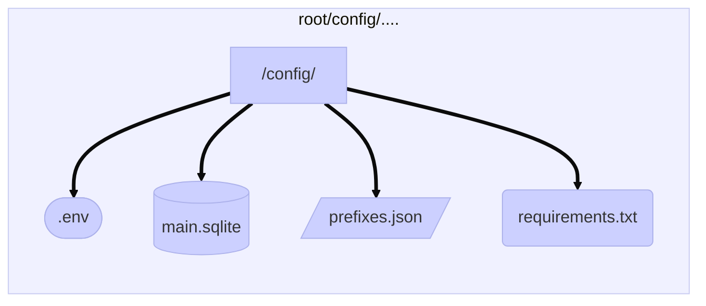
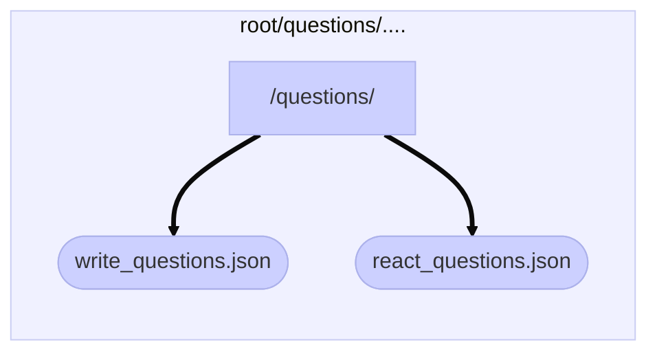

# BotWhitelist
# Sommaire

- [Documentations](#documentations) 
- [Présentation](#présentation)
- [Liste des modules](#liste-des-modules)
	- [Présentation des modules](#présentation-des-modules)
	- [Installation](#installation)
- [Configuration](#configuration)
	- [Environnement](#environnement)
		- [.env](#env)
		- [prefixes.json](#prefixes.json)
	- [Questions](#questions)
		- [write_questions.json](#write_questions.json)
		- [react_questions.json](#react_questions.json)
- [Liste des fonctions](#liste-des-fonctions)
	- [Fonctions du préfixe](#fonctions-du-préfixe)
		- [show_prefix](#show_prefix)
		- [change_prefix](#change_prefix)
	- [Fonctions help](#fonctions-help)
		- [help](#help)
		- [listing](#listing)
	- [Fonctions de setup whitelist](#fonction-de-setup-whitelist)
		- [setup_whitelist](#setup_whitelist)
- [Déroulement du questionnaire whitelist](#déroulement-du-questionnaire-whitelist)

# Documentations
#### - Lien vers la documentation [Discord.py](https://discordpy.readthedocs.io/en/stable/api.html)
#### - Lien vers la documentation [Python](https://docs.python.org/3.9/)
# Présentation
Bot codé en Python pour un besoin de valider des Whitelist sur un serveur GTA RP.
Il procède donc à une brève vérification par questionnaire d'un utilisateur.

La liste des questions est à édtier dans le dossier config, il y deux json pour les questions.

# Liste des modules 
## Présentation des modules
```python
discord.py>=1.7.3
aiosqlite>=0.17.0  # Utilisation d'une base .sqlite en asynchrone
python-dotenv>=0.19.2  # Utilisation du fichier .env
aiohttp>=3.8.1
```

## Installation
Utiliser la commande dans le dossier ``/config/``
```console
pip install --upgrade -r requirements.txt
```
# Configuration
## Environnement
Le dossier du bot se décompose en plusieurs type de dossier et fichier de configuration..


### .env
```
Le fichier .env permet de stocker toutes les informations
dont le bot pourrais avoir besoin. :
```
```
DATABASE_NAME=config/main.sqlite

JSON_PREFIX_NAME=config/prefixes.json

NUMBER_QUESTIONS = my_question_limit
JSON_WRITE_QUESTIONS="questions/write_questions.json"
JSON_REACT_QUESTIONS="questions/react_questions.json"


GUILD_ID=my_guild_id
TOKEN=my_bot_token
```
```diff
- NUMBER_QUESTIONS
	- c'est la limite de question qui sera posé.
	À savoir que le nombre d'erreur est 3 pour échouer
	le questionnaire.

+ GUILD_ID
	+ il faut renseigner l'id du premier serveur d'ajout du bot.

! TOKEN
	! il faut renseigner le token du bot.
```
### prefixes.json
> **Ce fichier par défaut est vide, il permet de stocker le préfixe pour chaque serveur du bot. (s'ajoute automatiquement)
> Préfixe de défaut ->  !**
## Questions

### write_questions.json
Ce fichier n'as pas vocation  à être modifié, il prend actuellement 5 questions écrite.
```json
[{
		"write_prompt"  :  "Question 1"
	},
	{
		"write_prompt"  :  "Question 2"
	},
	{
		"write_prompt"  :  "Question 3"
	},
	{
		"write_prompt"  :  "Question 4"
	},
	{
		"write_prompt"  :  "Question 5"
	}
]
```
### react_questions.json
> **Ce fichier contient donc les questions/réponses du questionnaire de whitelist, les questions / réponses prennent cette forment pour être entrées dans le fichier (en rajouter autant que possible pour la randomité des questions, le nombre de questions posée ne dépasseront pas la limite)**
```json
[{
		"question_prompt":  "Qui crains-tu le plus en ville ?",
		"question_answers_prompt":  [
			"1️⃣ Les ballas.",
			"2️⃣ Les policiers.",
			"3️⃣ J'ai peur de personne en ville.",
			"4️⃣ Tout le monde me fais peur."
		],
		"question_answer":  2
	},
	{
		"question_prompt":  "Si pour intégrer un groupe ton personnage n'est pas accepté. Que fais-tu ?",
		"question_answers_prompt":  [
			"1️⃣ Je wipe?",
			"2️⃣ Je vais dénoncer le groupe.",
			"3️⃣ Je continu mon personnage.",
			"4️⃣ Je me suicide."
		],
		"question_answer":  3
	}
]
```
# Liste des fonctions
## Fonctions du préfixe
#### show_prefix
> **Utiliser cette fonction, permet de connaître le préfixe du bot, en revanche le préfixe est également affiché dans le statut d'activité du bot.**
> Cette fonction ne prends aucun paramètre et aucune permissions ne sont requise.
#### change_prefix
> **Cette fonction permet la modification du préfixe du bot (pratique si d'autre bot du serveur utilisent le même préfixe).**
> Cette fonction prend donc en paramètre le nouveau préfixe du bot. Et la permission d'administrateur est requise.
```
!change_prefix $
```

## Fonctions help
#### help
> Cette fonction prends plusieurs type de paramètres. En revanche aucune permissions sont requise pour s'en servir.
> **Cette fonction est un peu particulière appellée sans paramètre, elle permet d'afficher un listing complet des modules (cogs) du bot comme le montre cette image :**
  
<p align="center"></p>

> **En revanche c'est également une fonction qui prend des paramètres, les noms des cogs seront toujours affiché avec une majuscule, et les fonctions toujours en miniscules. Donc si je veux savoir les fonctions qui sont contenue dans le modules ``Help`` ou bien ``CogSetupLog`` il me suffit de les appeler comme ci dessous :**

<p align="center"></p>

> **De cette même manière je peux savoir pour les fonctions, afin de connaître leurs syntaxe, si c'est une fonction qui s'utilise avec ou sans paramètres :**

<p align="center"></p>

#### listing
> **Cette fonctions permet simplement de faire une liste de toute les fonctions du bot sans infos supplémentaire.**
> Ne prend aucun paramètre et aucune permissions sont requise.

## Fonction de setup whitelist
#### setup_whitelist
> **Cette fonctions permet d'établir le salon qui permet l'ouverture d'un ticket whitelist**
> Ne prend aucun paramètre, mais la permissions ``administrateur`` est requise
# Déroulement du questionnaire whitelist
> Une fois que le salon ticket a été ouvert. Il suffit à l'utilisateur de cliquer sur la réaction pour pouvoir commencer un questionnaire whitelist.

L'utilisateur doit d'abord répondre à 5 questions où il doit écrire, comme son nom RP, son âge, le background de son personnage, etc, etc

**Ensuite le questionnaire se déroule avec un QCM.**
> **Les résultats du QCM sont envoyés dans un channel prévu à cet effet.** (la forme de retour risques d'ếtre changée en préférance d'un fichier contenant les réponses.

**Pour le compte des points**, l'utilisateur à le droit à 3 essais pour obtenir le rôle ``✅Validé`` et ``🌆Citoyens`` 

- Au premier essai loupé c'est le rôle ``🔴`` qui siginifie **"échouer une fois".**
- Au deuxième essai loupé c'est le rôle ``🔴🔴``.
- Au troisième essai c'est le rôle ``❌`` qui **empêche** l'utilisateur de **relancer un questionnaire.**

> ***À noter qu'un utilisateur avec le rôle ``✅Validé`` et ``🌆Citoyens`` ne peut pas relancer un questionnaire. Idem si un questionnaire est déjà en cours par un utilisateur, il ne peux pas en relancer un autre tant qu'il n'as pas finis son premier questionnaire.***

***Le salon où le questionnaire s'est déroulé, se supprime automatiquement 10 secondes après la fin du questionnaire.***
